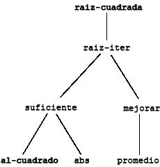

## 1.1 Los Elementos de la Programación

Un lenguaje de programación eficaz es más que un medio para instruir a una computadora para que realice tareas. El lenguaje también sirve como marco desde el cual organizamos nuestras ideas acerca de los procesos. Por lo tanto, cuando describimos un lenguaje, debemos prestar especial atención a los medios que el lenguaje proporciona para combinar ideas simples hasta formar ideas más complejas. Todo lenguaje eficaz tiene tres mecanismos para lograr esto:

* **expresiones primitivas**, que representan las entidades más simples que conciernen al lenguaje,

* **medios de combinación**, mediante los cuales los elementos compuestos se construyen a partir de los elementos más simples, y

* **medios de abstracción**, por el cual los elementos compuestos pueden ser nombrados y manipulados como unidades.

En programación nos ocupamos de dos tipos de elementos: procedimientos y datos (más adelante descubriremos que realmente no son tan distintos). Informalmente, los datos son "cosas" que queremos manipular, y los procedimientos son descripciones de las reglas para manipular los datos. Por lo tanto, cualquier lenguaje de programación eficaz debería ser capaz de describir datos y procedimientos primitivos y debería tener métodos para combinar y abstraer procedimientos y datos.

En este capítulo sólo trataremos con datos numéricos simples para que podamos concentrarnos en las reglas de construcción de procedimientos.<sup>[**4**](#nota-4)</sup> En capítulos posteriores veremos que estas mismas reglas nos permiten construir procedimientos para manipular también datos compuestos.


### 1.1.1 Expresiones

Una manera fácil de empezar a programar es analizando algunas interacciones típicas con el intérprete del dialecto Scheme de Lisp. Imagine que se encuentra sentado frente a una terminal de computadora. Ud. escribe una *expresión*, y el intérprete responde mostrando el resultado de la *evaluación* de esa expresión.

Una clase de expresión primitiva que uno puede escribir es un número (para ser más precisos, la expresión que uno escribe consiste en las cifras que representan al número en base 10). Si usted le presenta a Lisp un número

```scheme
486
```

el intérprete responderá imprimiendo<sup>[**5**](#nota-5)</sup>

```scheme
> 486
```

`(NdT: por cuestiones de edición, se usará el símbolo > de ahora en más para señalar el resultado de la evaluación de una expresión. En la obra original los autores simplemente muestran los resultados en cursiva)`.

Las expresiones que representan números pueden ser combinados en una expresión que represente un procedimiento primitivo (como `+` o `*`) para formar una expresión compuesta que represente la aplicación del procedimiento a esos números. Por ejemplo:

```scheme
(+ 137 349)
> 486

(- 1000 334)
> 666

(* 5 99)
> 495

(/ 10 5)
> 2

(+ 2.7 10)
> 12.7
```

Expresiones como estas, formadas al delimitar una lista de expresiones entre paréntesis con el fin de indicar la aplicación del procedimiento, son llamadas *combinaciones*. El elemento situado en el extremo izquierdo de la lista se llama el *operador*, y los otros elementos se llaman *operandos*. El valor de una combinación se obtiene aplicando el procedimiento especificado por el operador a los argumentos, que corresponden a los valores de los operandos.

La convención de colocar el operador a la izquierda de los operandos se conoce como *notación prefija* `(NdT: también conocido como "notación polaca")`, y puede ser algo confuso al principio porque se aparta significativamente de la convención matemática habitual. Sin embargo, la notación prefija tiene varias ventajas. Una de ellas es que puede acomodar procedimientos que pueden tomar un número arbitrario de argumentos, como en los siguientes ejemplos:

```scheme
(+ 21 35 12 7)
> 75

(* 25 4 12)
> 1200
```

No puede surgir ninguna ambigüedad, ya que el operador es siempre el elemento que está en el extremo izquierdo y toda la combinación está delimitada por los paréntesis.

Una segunda ventaja de la notación prefija es que se extiende de forma sencilla para permitir que las combinaciones sean *anidadas*, es decir, que tengan combinaciones cuyos elementos son en sí mismos combinaciones:

```scheme
(+ (* 3 5) (- 10 6))
> 19
```

No hay límite (en principio) a la profundidad de este tipo de anidamiento y a la complejidad general de las expresiones que el intérprete de Lisp puede evaluar. Somos nosotros los humanos los que nos confundimos por expresiones relativamente simples como

```scheme
(+ (* 3 (+ (* 2 4) (+ 3 5))) (+ (- 10 7) 6))
```

que el intérprete evaluaría fácilmente como 57. Podemos ayudarnos a nosotros mismos escribiendo esta misma expresión de la siguiente manera

```scheme
(+ (* 3
      (+ (* 2 4)
         (+ 3 5)))
   (+ (- 10 7)
      6))
```

siguiendo la convención de formato conocida como *pretty-printing* `(NdT: una traducción aceptable al español sería "formato mejorado" o "formato legible")`, en la que cada combinación larga se escribe de forma tal que los operandos queden alineados verticalmente. Las indentaciones resultantes muestran claramente la estructura de la expresión.<sup>[**6**](#nota-6)</sup>

Incluso con expresiones complejas, el intérprete siempre opera en el mismo ciclo básico: lee una expresión de la terminal, evalúa la expresión e imprime el resultado. Este modo de funcionamiento se expresa a menudo diciendo que el intérprete funciona en un bucle de lectura-evaluación-impresión `(NdT: en inglés "read-eval-print loop", o más conocido por su sigla "REPL")`. Observe en particular que no es necesario indicarle explícitamente al intérprete de que imprima el valor de la expresión.<sup>[**7**](#nota-7)</sup>


### 1.1.2 Los Nombres y el Entorno

Un aspecto crucial de un lenguaje de programación es el medio que proporciona para el uso de nombres que hacen referencia a objetos computacionales. Decimos que el nombre identifica a una *variable* cuyo valor es el objeto.

En el dialecto Scheme de Lisp, nombramos las cosas con `define`. Escribiendo

```scheme
(define tamaño 2)
```

`(NdT: define está expresado en inglés, como toda palabra reservada en Scheme)`


hace que el intérprete asocie el valor 2 con el nombre `tamaño`.<sup>[**8**](#nota-8)</sup> Una vez que el nombre `tamaño` ha sido asociado con el número 2, podemos referirnos al valor 2 por este nombre:

```scheme
tamaño
> 2

(* 5 tamaño)
> 10
```
Aquí hay más ejemplos del uso de `define`:

```scheme
(define pi 3.14159)

(define radio 10)

(* pi (* radio radio))
> 314.159

(define circunferencia (* 2 pi radio))

circunferencia
> 62.8318
```

`define` es el medio de abstracción más simple de nuestro lenguaje, ya que nos permite utilizar nombres sencillos para referirnos a los resultados de operaciones compuestas, como la `circunferencia` calculada anteriormente. En general, los objetos computacionales pueden tener estructuras muy complejas, y sería extremadamente incómodo tener que recordar y repetir sus detalles cada vez que queremos usarlos. En efecto, los programas complejos se elaboran construyendo, paso a paso, objetos computacionales de complejidad creciente. El intérprete hace que esta construcción paso a paso del programa sea muy conveniente porque las asociaciones nombre-objeto pueden ser creadas gradualmente en sucesivas interacciones. Esta característica fomenta el desarrollo incremental y el testeo de programas, y es en gran medida responsable del hecho de que un programa Lisp normalmente se componga de un gran número de procedimientos relativamente sencillos.

Debe quedar claro que la posibilidad de asociar valores con símbolos y luego llamarlos significa que el intérprete debe mantener algún tipo de memoria que mantenga un registro de los pares nombre-objeto. Esta memoria se llama el *entorno* (más precisamente el *entorno global*, ya que veremos más adelante que un cálculo puede implicar varios entornos diferentes).<sup>[**9**](#nota-9)</sup>


### 1.1.3 Evaluando Combinaciones

Uno de nuestros objetivos en este capítulo es el de identificar cuestiones relativas al pensamiento procedural. Como caso concreto, consideremos que al evaluar las combinaciones, el propio intérprete está siguiendo un procedimiento.

* Para evaluar una combinación, hacer lo siguiente:

  1) Evaluar las subexpresiones de la combinación.

  2) Aplicar el procedimiento, que es el valor del elemento situado en el extremo izquierdo  (el operador), a los argumentos que son los valores de las otras subexpresiones (los operandos).

Incluso esta simple regla demuestra algunos puntos importantes sobre los procesos en general. Primero, observe que el primer paso dicta que, para llevar a cabo el proceso de evaluación de una combinación, debemos primero realizar el proceso de evaluación de cada elemento de la combinación. Por lo tanto, la regla de evaluación es de naturaleza *recursiva*; es decir, incluye en una de sus etapas la necesidad de invocar a la propia regla.<sup>[**10**](#nota-10)</sup>

Observe cuán sucintamente se puede utilizar la idea de recursión para expresar lo que, en el caso de una combinación profundamente anidada, se vería de otro modo como un proceso bastante complicado. Por ejemplo, evaluar

```scheme
(* (+ 2 (* 4 6))
   (+ 3 5 7))
```

requiere que la regla de evaluación se aplique a cuatro combinaciones diferentes. Podemos obtener una imagen de este proceso representando la combinación en forma de árbol, como se muestra en la figura 1.1. Cada combinación está representada por un nodo con ramas que corresponden al operador y a los operandos de la combinación que se derivan de él. Los nodos terminales (es decir, nodos sin ramas que provengan de ellos) representan operadores o números. Viendo la evaluación en términos del árbol, podemos imaginar que los valores de los operandos se filtran hacia arriba, empezando por los nodos terminales y luego combinándose a niveles cada vez más altos y altos. En general, veremos que la recursividad es una técnica muy poderosa para tratar con objetos jerárquicos en forma de árbol. De hecho, la forma "filtrar valores hacia arriba" de la regla de evaluación es un ejemplo de un tipo general de proceso conocido como *acumulación de árbol* `(NdT: traducción literal de "tree accumulation")`.


**Figura 1.1:** Representación de un árbol, mostrando el valor de cada subcombinación.

A continuación, observe que la aplicación repetida del primer paso nos lleva al punto en el que necesitamos evaluar ya no combinaciones sino expresiones primitivas como números, operadores incorporados, u otros nombres. Nos ocupamos de los casos primitivos estableciendo que

* los valores numéricos son los números que estos representan,

* los valores de los operadores incorporados son las secuencias de instrucciones de máquina que realizan las operaciones correspondientes, y

* los valores de otros nombres son los objetos asociados a esos nombres en el entorno.

Podemos considerar la segunda regla como un caso especial de la tercera al estipular que símbolos como `+` y `*` también están incluidos en el entorno global, y que están asociados a las secuencias de instrucciones de máquina que son sus "valores". El punto clave a tener en cuenta es el papel del entorno en determinar el significado de los símbolos en las expresiones. En un lenguaje interactivo como Lisp, no tiene sentido hablar del valor de una expresión como `(+ x 1)` sin especificar ninguna información sobre el entorno que proporcione un significado para el símbolo `x` (o incluso para el símbolo `+`). Como veremos en el [capítulo 3](./19-capitulo-3-intro.md), la noción general de que el entorno proporciona un contexto en el que tiene lugar la evaluación desempeñará un papel importante en nuestra comprensión de la ejecución de los programas.

Observe que la regla de evaluación arriba mencionada no maneja definiciones. Por ejemplo, evaluar `(define x 3)` no se aplica a dos argumentos, uno de los cuales es el valor del símbolo `x` y el otro es `3`, ya que el propósito de la definición es precisamente asociar `x` con un valor (es decir, `(define x 3)` no es una combinación).

Estas excepciones a la regla general de evaluación son llamadas *formas especiales*. `define` es el único ejemplo de una forma especial que hemos visto hasta ahora, pero nos encontraremos con otros en breve. Cada forma especial tiene su propia regla de evaluación. Las distintas clases de expresiones (cada una con su regla de evaluación asociada) constituyen la sintaxis del lenguaje de programación. En comparación con la mayoría de los otros lenguajes de programación, Lisp tiene una sintaxis muy simple; es decir, la regla de evaluación de expresiones puede ser descrita mediante una simple regla general junto con reglas especializadas para un pequeño número de formas especiales.<sup>[**11**](#nota-11)</sup>.


### 1.1.4 Procedimientos Compuestos

Hemos identificado en Lisp algunos de los elementos que deben aparecer en cualquier lenguaje de programación eficaz:

* Los números y las operaciones aritméticas son datos y procedimientos primitivos.

* El anidamiento de combinaciones proporciona un medio para combinar operaciones.

* Las definiciones que asocian nombres con valores proporcionan un medio limitado de abstracción. 

Ahora aprenderemos sobre las *definiciones de procedimientos*, una técnica de abstracción mucho más poderosa mediante la cual se puede dar un nombre a una operación compuesta y luego referirse a ella como una unidad.

Comencemos examinando cómo expresar la idea de "al cuadrado". Podríamos decir: "Para elevar al cuadrado algo, multiplíquelo por sí mismo". Esto se expresa en nuestro lenguaje como 

```scheme
(define (al-cuadrado x) (* x x))
```

Podemos entender esto de la siguiente manera:

```
(define (al-cuadrado        x)   (*             x   x))
 ↑       ↑                  ↑     ↑             ↑   ↑                             
 Para    elevar al cuadrado algo, multiplicarlo por si mismo.
```

Tenemos aquí un *procedimiento compuesto*, al que se le ha dado el nombre `al-cuadrado`. El procedimiento representa la operación de multiplicar algo por sí mismo. La cosa a multiplicar se le da un nombre local, `x`, que juega el mismo papel que los pronombres juegan en el lenguaje natural. La evaluación de la definición crea este procedimiento compuesto y lo asocia con el nombre `al-cuadrado`.<sup>[**12**](#nota-12)</sup>

La forma general para la definición de un procedimiento es

```scheme
(define (<nombre> <parámetros formales>) <cuerpo>)
```

El *`<nombre>`* es un símbolo que se asocia con la definición del procedimiento en el entorno.<sup>[**13**](#nota-13)</sup> Los *`<parámetros formales>`* son los nombres utilizados dentro del cuerpo del procedimiento para referirse a los argumentos correspondientes del procedimiento mismo. El *`<cuerpo>`* es una expresión que generará el valor de la aplicación del procedimiento cuando los parámetros formales son reemplazados por los argumentos reales a los que se aplica el procedimiento.<sup>[**14**](#nota-14)</sup> El *`<nombre>`* y los *`<parámetros formales>`* se agrupan entre paréntesis, justo como lo estarían si se tratara de una llamada real al procedimiento que se está definiendo.

Habiendo definido `al-cuadrado`, ahora podemos usarlo:

```scheme
(al-cuadrado 21)
> 441

(al-cuadrado (+ 2 5))
> 49

(al-cuadrado (al-cuadrado 3))
> 81
```
También podemos usar `al-cuadrado` como un bloque de construcción en la definición de otros procedimientos. Por ejemplo, x² + y² puede expresarse como

```scheme
(+ (al-cuadrado x) (al-cuadrado y))
```
Podemos definir fácilmente un procedimiento `suma-de-cuadrados` que, dados dos números cualesquiera como argumentos, produce la suma de sus cuadrados:

```scheme
(define (suma-de-cuadrados x y)
  (+ (al-cuadrado x) (al-cuadrado y)))

(suma-de-cuadrados 3 4)
> 25
```

Ahora podemos usar `suma-de-cuadrados` como un bloque de construcción en la construcción de otros procedimientos:

```scheme
(define (f a)
  (suma-de-cuadrados (+ a 1) (* a 2)))

(f 5)
> 136
```

Los procedimientos compuestos son usados exactamente de la misma manera que los procedimientos primitivos. De hecho, uno no podría decir al mirar la definición de `suma-de-cuadrados` dada arriba si `al-cuadrado` fue construido dentro del intérprete, como `+` y `*`, o definido como un procedimiento compuesto.


### 1.1.5 El Modelo de Sustitución para la Aplicación de Procedimientos

Para evaluar una combinación cuyo operador nombra a un procedimiento compuesto, el intérprete sigue el mismo proceso aplicado a las combinaciones cuyos operadores nombran procedimientos primitivos, tal como describimos en la [sección 1.1.3](./10-capitulo-1-seccion-1-1.md#113-Evaluando-Combinaciones). Es decir, el intérprete evalúa los elementos de la combinación y aplica el procedimiento (que es el valor del operador de la combinación) a los argumentos (que son los valores de los operandos de la combinación).

Podemos asumir que el mecanismo para aplicar los procedimientos primitivos a los argumentos está incorporado dentro del intérprete. Para los procedimientos compuestos, el proceso de aplicación es el siguiente:

* Para aplicar un procedimiento compuesto a los argumentos, evalúe el cuerpo del procedimiento con cada parámetro formal sustituido por el argumento correspondiente.

Para ilustrar este proceso, evaluemos la combinación

```scheme
(f 5)
```

donde `f` es el procedimiento definido en la [sección 1.1.4](./10-capitulo-1-seccion-1-1.md#114-Procedimientos-Compuestos). Comencemos entonces por recuperar el cuerpo de `f`:

```scheme
(suma-de-cuadrados (+ a 1) (* a 2))
```

Luego reemplazamos el parámetro formal `a` por el argumento 5:

```scheme
(suma-de-cuadrados (+ 5 1) (* 5 2))
```

Por lo tanto, el problema se reduce a la evaluación de una combinación con dos operandos y un operador `suma-de-cuadrados`. Evaluar esta combinación implica tres subproblemas. Debemos evaluar al operador para conseguir que el procedimiento se aplique, y debemos evaluar a los operandos para conseguir los argumentos. Ahora `(+ 5 1)` produce 6 y `(* 5 2)` produce 10, por lo que debemos aplicar el procedimiento de `suma-de-cuadrados` a 6 y 10. Estos valores sustituyen a los parámetros formales `x` e `y` en el cuerpo de `suma-de-cuadrados`, reduciendo la expresión a


```scheme
(+ (al-cuadrado 6) (al-cuadrado 10))
```

Si usamos la definición de `al-cuadrado`, esto se reduce a

```scheme
(+ (* 6 6) (* 10 10))
```

que se reduce por multiplicación a

```scheme
(+ 36 100)
```

y finalmente a

```scheme
> 136
```

El proceso que acabamos de describir se denomina *modelo de sustitución* para la aplicación de procedimientos. Puede tomarse como un modelo que determina el "significado" de la aplicación de procedimientos, en la medida en que concierne a los procedimientos de este capítulo. Sin embargo, hay dos puntos que deben ser remarcados:

* El propósito de la sustitución es ayudarnos a pensar en la aplicación del procedimiento, no para proporcionar una descripción de cómo funciona realmente el intérprete. Los intérpretes convencionales no evalúan las aplicaciones de procedimientos al manipular el texto de un procedimiento con el fin de sustituir los parámetros formales por valores. En la práctica, la "sustitución" se realiza al usar un entorno local para los parámetros formales. Discutiremos esto más detenidamente en los capítulos [3](./19-capitulo-3-intro.md) y [4](./25-capitulo-4-intro.md) cuando examinemos la implementación de un intérprete en detalle.

* A lo largo del curso de este libro, presentaremos una secuencia de modelos cada vez más elaborados de cómo trabajan los intérpretes, culminando con la implementación completa de un intérprete y compilador en el [capítulo 5](./30-capitulo-5-intro.md). El modelo de sustitución es sólo el primero de estos modelos, una forma de empezar a pensar formalmente sobre el proceso de evaluación. En general, al modelar fenómenos en ciencia e ingeniería, comenzamos con modelos simplificados e incompletos. A medida que examinamos las cosas en mayor detalle, estos modelos simples se vuelven inadecuados y deben ser reemplazados por modelos más refinados. El modelo de sustitución no es la excepción. En particular, cuando abordemos en el [capítulo 3](./19-capitulo-3-intro.md) el uso de procedimientos con "datos mutables", veremos que el modelo de sustitución se rompe y debe ser reemplazado por un modelo más complicado de aplicación de procedimientos.<sup>[**15**](#nota-15)</sup>


#### Orden aplicativo versus orden normal

De acuerdo con la descripción de evaluación dada en la [sección 1.1.3](./10-capitulo-1-seccion-1-1.md#113-Evaluando-Combinaciones), el intérprete primero evalúa el operador y los operandos y luego aplica el procedimiento resultante a los argumentos resultantes. Esta no es la única manera de realizar una evaluación. Un modelo de evaluación alternativo no evaluaría los operandos hasta que se necesitaran sus valores. En lugar de ello, primero sustituiría los parámetros por expresiones de operandos hasta que obtenga una expresión que involucre sólo a operadores primitivos, y luego realizaría la evaluación. Si utilizamos este método, la evaluación de

```scheme
(f 5)
```

procedería de acuerdo a la secuencia de expansiones

```scheme
(suma-de-cuadrados (+ 5 1) (* 5 2))

(+  (al-cuadrado  (+ 5 1)) (al-cuadrado (* 5 2)))

(+  (* (+ 5 1) (+ 5 1))    (* (* 5 2) (* 5 2)))
```

seguido de las reducciones

```scheme
(+  (* 6 6)                (* 10 10))

(+  36                     100)

> 136
```

Esto da la misma respuesta que nuestro modelo de evaluación anterior, pero el proceso es diferente. En particular, las evaluaciones de `(+ 5 1)` y `(* 5 2)` se realizan aquí dos veces cada una, lo que corresponde a la reducción de la expresión

```scheme
(* x x)
```

con x reemplazado respectivamente por `(+ 5 1)` y `(* 5 2)`.

Este método alternativo de evaluación de "expandir completamente y reducir después" se conoce como *evaluación de orden normal*, en contraste con el método de "evaluar los argumentos y luego aplicar" que el intérprete actualmente utiliza, que se denomina *evaluación de orden aplicable*. Puede demostrarse que, para las aplicaciones de procedimientos que pueden modelarse utilizando la sustitución (incluyendo todos los procedimientos en los dos primeros capítulos de este libro) y que producen valores legítimos, la evaluación de orden normal y la de orden aplicativo producen el mismo valor (ver ejercicio 1.5 para un ejemplo de un valor "ilegítimo" donde la evaluación de orden normal y la de orden aplicativo no dan el mismo resultado).

Lisp utiliza la evaluación de orden aplicativo, en parte debido a la eficiencia adicional obtenida al evitar evaluaciones múltiples de expresiones como la que demostramos anteriormente con (+ 5 1) y (* 5 2) y, más importante aún, porque la evaluación de orden normal se vuelve mucho más complicada cuando abandonamos el ámbito de los procedimientos que pueden ser modelados por sustitución. Por otro lado, la evaluación de orden normal puede ser una herramienta extremadamente valiosa, y vamos a investigar algunas de sus implicaciones en los capítulos [3](./19-capitulo-3-intro.md) y [4](./25-capitulo-4-intro.md).<sup>[**16**](#nota-16)</sup>


### 1.1.6 Expresiones Condicionales y Predicados

El poder expresivo de la clase de procedimientos que podemos definir hasta ahora es muy limitado, ya que no tenemos forma de hacer comprobaciones y de realizar diferentes operaciones en función del resultado de un test. Por ejemplo, no podemos definir un procedimiento que calcule el valor absoluto de un número comprobando si el número es positivo, negativo o cero y tomando diferentes acciones en los diferentes casos de acuerdo a la regla

```
      ⎧  x  si x > 0
⎪x⎪ = ⎨  0  si x = 0
      ⎩ -x  si x < 0
```

Esta construcción se denomina *análisis de caso*, y existe una forma especial en Lisp para anotar dichos análisis de casos. Se llama `cond` (que viene de "condicional"), y se usa de la siguiente manera:

```scheme
(define (abs x)
  (cond ((> x 0) x)
        ((= x 0) 0)
        ((< x 0) (- x))))
```

La forma general de una expresión condicional es

```scheme
(cond (<p1> <e1>)
      (<p2> <e2>)
      ⋮
      (<pn> <en>))
```

que consiste en el símbolo `cond` seguido de pares entre paréntesis de expresiones `(<p> <e>)` llamados *claúsulas*. La primera expresión en cada par es un predicado, es decir, una expresión cuyo valor se interpreta como verdadero o falso.<sup>[**17**](#nota-17)</sup>

Las expresiones condicionales se evalúan de la siguiente manera: el predicado `<p1>` se evalúa primero. Si su valor es falso, entonces se evalúa `<p2>`. Si el valor de `<p2>` también es falso, entonces se evalúa `<p3>`. Este proceso continúa hasta que se encuentra un predicado cuyo valor es verdadero, en cuyo caso el intérprete devuelve el valor correspondiente de la *expresión consecuente* `<e>` de la cláusula como valor de la expresión condicional. Si ninguno de los `<p>` es verdadero, el valor del `cond` es indefinido.

La palabra *predicado* es usado por procedimientos que devuelven verdadero o falso, así como para expresiones que evalúen a verdadero o falso. El procedimiento del valor absoluto `abs` hace uso de los predicados primitivos `>`, `<`, y `=`.<sup>[**18**](#nota-18)</sup> Estos toman dos números como argumentos y prueban si el primer número es, respectivamente, mayor que, menor que, o igual al segundo número, devolviendo verdadero o falso en consecuencia.

Otra forma de escribir el procedimiento de valor absoluto es

```scheme
(define (abs x)
  (cond ((< x 0) (- x))
        (else x)))
```

que podría expresarse en inglés como "Si x es menor que cero, devolver -x; en caso contrario, devolver x". `Else` es un símbolo especial que puede ser usado en lugar de `<p>` en la cláusula final de un `cond`. Esto hace que el `cond` devuelva como su valor el valor del `<e>` correspondiente cuando todas las cláusulas anteriores han sido pasadas. De hecho, cualquier expresión que evalúe siempre a un valor verdadero podría ser usado como `<p>` aquí.

Aquí hay otra manera de escribir el procedimiento de valor absoluto:

```scheme
(define (abs x)
  (if (< x 0)
      (- x)
      x))
```

Esto usa la forma especial `if`, un tipo restringido de condicional que puede ser usado cuando solo exista precisamente dos casos en el análisis de casos. La forma general de una expresión `if` es

```scheme
(if <predicado> <consecuente> <alternativa>)
```

Para evaluar una expresión `if`, el intérprete comienza por evaluar la parte del predicado de la expresión. Si el `<predicado>` se evalúa a un valor verdadero, el intérprete evalúa el `<consecuente>` y devuelve su valor. De lo contrario, evalúa la `<alternativa>` y devuelve su valor.<sup>[**19**](#nota-19)</sup>

Además de predicados primitivos como `<`, `=`, y `>`, hay operaciones de composición lógica, que nos permiten construir predicados compuestos. Los tres más utilizados son estos:

* `(and <e1> ... <en>)`

    El intérprete evalúa las expresiones `<e>` una por una, en orden de izquierda a derecha. Si alguna `<e>` se evalúa como falsa, el valor de la expresión `and` es falso, y el resto de las `<e>` no se evaluarán. Si todas las `<e>` evalúan a valores verdaderos, el valor de la expresión `and` será el valor de la última.

* `(or <e1> ... <en>)`

    El intérprete evalúa las expresiones `<e>` una por una, en orden de izquierda a derecha. Si cualquier `<e>` evalúa a un valor verdadero, ese valor se devuelve como el valor de la expresión `or`, y el resto de las `<e>` no se evaluarán. Si todas las `<e>` evalúan a falso, el valor de la expresión `or` es falso.

* `(not <e>)`
    El valor de una expresión `not` es verdadero cuando la expresión `<e>` se evalúa como falsa, de lo contrario es falsa.

Observe que `and` y `or` son formas especiales, no procedimientos, porque las subexpresiones no son necesariamente evaluadas. `not` es un procedimiento ordinario.

A modo de ejemplo de cómo se utilizan, la condición de que un número x esté en el rango 5 < x < 10 puede expresarse como

```scheme
(and (> x 5) (< x 10))
```

En otro ejemplo, podemos definir un predicado para probar si un número es mayor o igual a otro como

```scheme
(define (>= x y)
  (or (> x y) (= x y)))
```

o alternativamente como

```scheme
(define (>= x y)
  (not (< x y)))
```

**Ejercicio 1.1.** Abajo hay una secuencia de expresiones. ¿Cuál es el resultado obtenido por el intérprete en respuesta a cada expresión? Suponga que la secuencia debe evaluarse en el orden en que se presenta.

```scheme
10

(+ 5 3 4)

(- 9 1)

(/ 6 2)

(+ (* 2 4) (- 4 6))

(define a 3)

(define b (+ a 1))

(+ a b (* a b))

(= a b)

(if (and (> b a) (< b (* a b)))
    b
    a)

(cond ((= a 4) 6)
      ((= b 4) (+ 6 7 a))
      (else 25))

(+ 2 (if (> b a) b a))

(* (cond ((> a b) a)
         ((< a b) b)
         (else -1))
   (+ a 1))
```

**Ejercicio 1.2.** Traduzca la siguiente expresión en forma de prefijo

```
5 + 4 + (2 - (3 - (6 + 4/5)))
―――――――――――――――――――――――――――――
       3(6 - 2)(2 - 7)
```

**Ejercicio 1.3.** Defina un procedimiento que tome tres números como argumentos y devuelva la suma de los cuadrados de los dos números mayores.

**Ejercicio 1.4.** Observe que nuestro modelo de evaluación permite combinaciones cuyos operadores son expresiones compuestas. Haga uso de esta observación para describir el comportamiento del siguiente procedimiento:

```scheme
(define (a-plus-abs-b a b)
  ((if (> b 0) + -) a b))
```

**Ejercicio 1.5.** Ben Bitdiddle ha inventado una prueba para determinar si el intérprete con el que se encuentra utiliza la evaluación de orden aplicativo o la evaluación de orden normal. Él define los dos procedimientos siguientes:

```scheme
(define (p) (p))

(define (test x y)
  (if (= x 0)
      0
      y))
```
Después él evalúa la expresión

```scheme
(test 0 (p))
```

¿Qué comportamiento observará Ben con un intérprete que utiliza la evaluación de orden aplicativo? ¿Qué comportamiento observará con un intérprete que utiliza una evaluación de orden normal? Explique su respuesta (suponga que la regla de evaluación para la forma especial es la misma, ya sea que el intérprete esté utilizando el orden normal o el orden aplicativo: la expresión del predicado se evalúa primero, y el resultado determina si se debe evaluar la expresión consecuente o la expresión alternativa).


### 1.1.7 Ejemplo: Raíces cuadradas por el método de Newton

Los procedimientos, como se han explicado anteriormente, son muy parecidos a las funciones matemáticas ordinarias. Éstos especifican un valor determinado por uno o más parámetros. Pero hay una diferencia importante entre las funciones matemáticas y los procedimientos informáticos. Los procedimientos deben ser efectivos.

Como ejemplo concreto, consideremos el problema de computar las raíces cuadradas. Podemos definir la función de raíz cuadrada como

```
√x = de y tal que y >= 0 e y² = x
```

Esto describe una función matemática perfectamente legítima. Podríamos usarlo para reconocer si un número es la raíz cuadrada de otro, o para derivar hechos sobre las raíces cuadradas en general. Por otra parte, la definición no describe un procedimiento. De hecho, no nos dice casi nada sobre cómo encontrar realmente la raíz cuadrada de un número dado. No ayudaría mucho reformular esta definición en pseudo-Lisp:

```
(define (raiz cuadrada de x)
  (la variable y (and (>= y 0)
              (= (elevar al cuadrado y) x))))
```

Esto sólo nos plantea la pregunta.

El contraste entre función y procedimiento es un reflejo de la distinción general entre describir las propiedades de las cosas y describir cómo hacerlas o, como a veces se le llama, la distinción entre el conocimiento declarativo y el conocimiento imperativo. En matemáticas por lo general nos ocupamos de las descripciones declarativas (lo que es), mientras que en informática nos ocupamos de las descripciones imperativas (cómo hacerlo).<sup>[**20**](#nota-20)</sup>

¿Cómo puede uno calcular las raíces cuadradas? La forma más común es usar el método de aproximaciones sucesivas de Newton, el cual dice que siempre que tengamos una estimación cualquiera `y` para el valor de la raíz cuadrada de un número `x`, podemos realizar una simple manipulación para obtener una mejor estimación (una más cercana a la raíz cuadrada real) promediando `y` con `x/y`.<sup>[**21**](#nota-21)</sup> Por ejemplo, podemos calcular la raíz cuadrada de 2 de la siguiente manera. Supongamos que nuestra suposición inicial es 1:

```
Estimación  Cociente             Promedio
  
1           (2/1) = 2            ((2 + 1)/2) = 1.5
  
1.5         (2/1.5) = 1.3333     ((1.3333 + 1.5)/2) = 1.4167
  
1.4167      (2/1.4167) = 1.4118  ((1.4167 + 1.4118)/2) = 1.4142
  
1.4142      ...                  ...
```

Continuando con este proceso, obtenemos cada vez mejores aproximaciones a la raíz cuadrada.

Ahora formalicemos el proceso en términos de procedimientos. Comenzamos con un valor para el radicando (el número cuya raíz cuadrada estamos tratando de calcular) y un valor para la estimación. Si la estimación es lo suficientemente buena para nuestros propósitos, hemos terminado; si no, debemos repetir el proceso con una estimación mejor. Escribimos esta estrategia básica como un procedimiento:

```scheme
(define (raiz-iter estimacion x)
  (if (suficientemente-bueno? estimacion x)
      estimacion
      (raiz-iter (mejorar estimacion x)
                 x)))
```

Una estimación se mejora al promediarla con el cociente del radicando y la anterior estimación:

```scheme
(define (mejorar estimacion x)
  (promedio estimacion (/ x estimacion)))
```

donde

```scheme
(define (promedio x y)
  (/ (+ x y) 2))
```

También tenemos que explicar lo que entendemos por "suficientemente bueno". Lo siguiente servirá para ilustrar, pero no es realmente un buen test (ver ejercicio 1.7). La idea es mejorar la respuesta hasta que esté lo suficientemente cerca como para que su cuadrado difiera del radicando por debajo de una tolerancia predeterminada (en este caso 0.001):<sup>[**22**](#nota-22)</sup>

```scheme
(define (suficientemente-bueno? estimacion x)
  (< (abs (- (al-cuadrado estimacion) x)) 0.001))
```

Finalmente, necesitamos una manera de poder comenzar. Por ejemplo, siempre podemos poner como estimación para la raíz cuadrada de cualquier número en 1:<sup>[**23**](#nota-23)</sup>

```scheme
(define (raiz-cuadrada x)
  (raiz-iter 1.0 x))
```

Si nosotros escribimos estas definiciones en el intérprete, podemos usar `raiz-cuadrada` de la misma manera que podemos usar cualquier procedimiento

```scheme
(raiz-cuadrada 9)
> 3.00009155413138
```
```scheme
(raiz-cuadrada (+ 100 37))
> 11.704699917758145
```
```scheme
(raiz-cuadrada (+ (raiz-cuadrada 2) (raiz-cuadrada 3)))
> 1.7739279023207892
```
```scheme
(al-cuadrado (raiz-cuadrada 1000))
> 1000.000369924366
```

El programa `raiz-cuadrada` también ilustra que el simple lenguaje procedural que hemos introducido hasta ahora es suficiente como para escribir cualquier programa puramente numérico que se pueda escribir en, digamos, C o Pascal. Esto puede parecer sorprendente, ya que no hemos incluido en nuestro lenguaje ninguna construcción iterativa (looping - `NdT: al español se traduce como "iteración"`) que dirija a la computadora a hacer algo una y otra vez. `raiz-iter`, por otro lado, demuestra cómo se puede lograr la iteración sin utilizar ninguna construcción especial que no sea la capacidad ordinaria de llamar a un procedimiento.<sup>[**24**](#nota-24)</sup>

**Ejercicio 1.6.** Alyssa P. Hacker no ve por qué `if` necesita ser provisto como una forma especial. "¿Por qué no puedo simplemente definirlo como un procedimiento ordinario en términos de `cond`?", pregunta ella. La amiga de Alyssa, Eva Lu Ator, asegura que esto se puede hacer, y define una nueva versión de `if`:

```scheme
(define (nuevo-if predicado entonces-clausula caso-contrario-clausula)
  (cond (predicado entonces-clausula)
        (else caso-contrario-clausula)))
```

Eva demuestra el programa para Alyssa:

```scheme
(nuevo-if (= 2 3) 0 5)
> 5
```
```scheme
(nuevo-if (= 1 1) 0 5)
> 0
```

Entusiasmada, Alyssa usa el `nuevo-if` para reescribir el programa `raiz-cuadrada`:

```scheme
(define (raiz-iter estimacion x)
  (nuevo-if (suficientemente-bueno? estimacion x)
          estimacion
          (raiz-iter (mejorar estimacion x)
                     x)))
```

¿Qué sucederá cuando Alyssa intente usar esto para calcular raíces cuadradas? Explicar.

**Ejercicio 1.7.** El test `suficientemente-bueno?` utilizado en el cálculo de raíces cuadradas no resulta muy efectivo para encontrar las raíces cuadradas de números muy pequeños. Además, en computadoras reales, las operaciones aritméticas casi siempre se realizan con una precisión limitada. Esto hace que nuestro test sea inadecuado para números muy grandes. Explique estas afirmaciones, con ejemplos que muestren cómo el test falla para números pequeños y grandes. Una estrategia alternativa para implementar `suficientemente-bueno?` sería estudiar cómo cambia `estimacion` de una iteración a la otra y detenerse cuando el cambio sea una fracción muy pequeña de la estimación. Diseñe un procedimiento de raíz cuadrada que utilice este tipo de prueba final. ¿Funciona mejor para pequeños y grandes números?

**Ejercicio 1.8.** El método de Newton para raíces cúbicas se basa en el hecho de que si `y` es una aproximación a la raíz cúbica de `x`, entonces una mejor aproximación es dada por el valor 

```
x/y² + 2y
―――――――――
    3
```

### 1.1.8 Procedimientos como Abstracciones de Caja Negra

La `raiz-cuadrada` es nuestro primer ejemplo de un proceso definido por un conjunto de procedimientos mutualmente definidos. Note que la definición de `raiz-iter` es recursiva; es decir, el procedimiento se define en términos de sí mismo. La idea de poder definir un procedimiento en términos de sí mismo puede resultar perturbadora; parece poco claro cómo podría tener sentido una definición tan "circular", y mucho menos aún especificar un proceso bien definido que debe ser llevado a cabo por una computadora. Esto se abordará con más detenimiento en la [sección 1.2](./11-capitulo-1-seccion-1-2.md). Pero primero consideremos algunos otros puntos importantes ilustrados por este caso `raiz-cuadrada`.

Observe que el problema de computar las raíces cuadradas se divide naturalmente en una serie de subproblemas: cómo decir si una estimación es lo suficientemente buena, cómo mejorar una estimación, y así sucesivamente. Cada una de estas tareas se lleva a cabo mediante un procedimiento independiente. Todo el programa `raiz-cuadrada` puede ser visto como un conjunto de procedimientos (mostrado en la figura 1.2) que refleja la descomposición del problema en subproblemas.



**Figura 1.2:** Descomposición procedural del programa `raiz-cuadrada`.

La importancia de esta estrategia de descomposición no radica simplemente en que uno esté dividiendo el programa en partes. Después de todo, podríamos tomar cualquier programa grande y dividirlo en secciones: las primeras diez líneas, las próximas diez líneas, las siguientes diez líneas, y así sucesivamente. Más bien, es crucial que cada procedimiento lleve a cabo una tarea identificable que pueda ser utilizada como un módulo para definir otros procedimientos. Por ejemplo, cuando definimos el procedimiento `suficientemente-bueno?` en términos de `al-cuadrado`, podemos considerar el procedimiento `al-cuadrado` como una "caja negra". En estos momentos no nos preocupa el modo en que el procedimiento calcula su resultado, sino el hecho de que calcule el cuadrado del número. Los detalles de cómo se calcula el cuadrado pueden ser omitidos, para ser considerados en otro momento. De hecho, en lo que respecta al procedimiento `suficientemente-bueno?`, `al-cuadrado` no es un procedimiento, sino más bien lo que se denomina *abstracción procedural*. En este nivel de abstracción, cualquier procedimiento que calcule el cuadrado es igualmente bueno.

Por lo tanto, considerando sólo los valores que se devuelven, los dos procedimientos siguientes para obtener el cuadrado de un número deben ser indistinguibles. Cada uno toma un argumento numérico y produce el cuadrado de ese número como valor.<sup>[**25**](#nota-25)</sup>

```scheme
(define (al-cuadrado x) (* x x))

(define (al-cuadrado x) 
  (exp (doble (log x))))

(define (doble x) (+ x x))
```

Por lo tanto, una definición de procedimiento debería ser capaz de ocultar detalles. Los usuarios del procedimiento pueden no haber escrito el procedimiento ellos mismos, pero pueden haberlo obtenido de otro programador como una caja negra. Un usuario no necesita saber cómo se implementa el procedimiento para poder utilizarlo.


#### Nombres locales

Un detalle de la implementación de un procedimiento que no debería importar al usuario del mismo es la elección de los nombres de los parámetros formales del procedimiento por parte del implementador. Por lo tanto, los siguientes procedimientos no deberían ser distinguibles:

```scheme
(define (al-cuadrado x) (* x x))

(define (al-cuadrado y) (* y y))
```

Este principio -que el significado de un procedimiento debe ser independiente de los nombres de los parámetros utilizados por su autor- parece evidente en la superficie, pero sus consecuencias son profundas. La consecuencia más simple es que los nombres de los parámetros de un procedimiento deben ser locales para el cuerpo del procedimiento. Por ejemplo, usamos `al-cuadrado` en la definición de `suficientemente-bueno?` en nuestro procedimiento de elevar al cuadrado:

```scheme
(define (suficientemente-bueno? estimacion x)
  (< (abs (- (al-cuadrado estimacion) x)) 0.001))
```

La intención del creador de `suficientemente-bueno?` es determinar si el cuadrado del primer argumento está dentro de una tolerancia dada del segundo argumento. Vemos que el autor de `suficientemente-bueno?` usó el nombre `estimacion` para referirse al primer argumento y `x` para referirse al segundo. El argumento de `al-cuadrado` es `estimacion`. Si el autor de `al-cuadrado` usó `x` (como figura más arriba) para referirse a ese argumento, vemos que el `x` en `suficientemente-bueno?` debe ser un `x` diferente que el de `al-cuadrado`. Ejecutar el procedimiento `al-cuadrado` no debe afectar el valor de `x` que es usado por `suficientemente-bueno?`, porque ese valor de `x` puede ser necesitado por `suficientemente-bueno?` después de que `al-cuadrado` se termine de computar.

Si los parámetros no fueran locales a los cuerpos de sus respectivos procedimientos, entonces el parámetro `x` en `al-cuadrado` podría confundirse con el parámetro `x` en `suficientemente-bueno?`, y el comportamiento de `suficientemente-bueno?` dependería de la versión de `al-cuadrado` que utilicemos. Por lo tanto, `al-cuadrado` no sería la caja negra que deseábamos.

Un parámetro formal de un procedimiento tiene un rol muy especial en la definición del procedimiento, en el sentido de que no importa el nombre que tenga el parámetro formal. Tal nombre se llama *variable vinculada*, y decimos que la definición del procedimiento *vincula* sus parámetros formales. El significado de la definición de un procedimiento no cambia si una variable vinculada es renombrada consistentemente a lo largo de la definición.<sup>[**26**](#nota-26)</sup> Si una variable no está vinculada, decimos que es *libre*. El conjunto de expresiones para los que un vínculo define un nombre se llama el *ámbito* de ese nombre `(NdT: "scope" en inglés)`. En una definición de procedimiento, las variables vinculadas que son declaradas como parámetros formales del procedimiento tienen como ámbito de aplicación el cuerpo mismo del procedimiento.

En la definición de `suficientemente-bueno?` mencionada arriba, `estimacion` y `x` son variables vinculadas pero `<`, `-`, `abs`, y `al-cuadrado` son libres. El significado de `suficientemente-bueno?` debe ser independiente de los nombres que elijamos para `estimacion` y `x`, siempre y cuando sean distintos y diferentes de `<`, `-`, `abs`, y `al-cuadrado` (si cambiásemos el nombre de `estimacion` por el de `abs`, hubiésemos introducido un error al *capturar* la variable `abs`). Habría pasado de libre a vinculada. Sin embargo, el significado de `suficientemente-bueno?` no es independiente de los nombres de sus variables libres. Depende seguramente del hecho (externo a esta definición) de que el símbolo `abs` nombre a un procedimiento para calcular el valor absoluto de un número. `Suficientemente bueno?` computará una función diferente si sustituimos `cos` por `abs` en su definición.


#### Definiciones internas y estructura de bloques

Tenemos disponible un tipo de aislamiento de nombre hasta ahora: Los parámetros formales de un procedimiento son locales al cuerpo del procedimiento. El programa de raiz cuadrada ilustra otra manera en la que nos gustaría controlar el uso de los nombres. El programa hasta ahora consiste de procedimientos separados:

```scheme
(define (raiz-cuadrada x)
  (raiz-iter 1.0 x))

(define (raiz-iter estimacion x)
  (if (suficientemente-bueno? estimacion x)
      estimacion
      (raiz-iter (mejorar estimacion x) x)))

(define (suficientemente-bueno? estimacion x)
  (< (abs (- (al-cuadrado estimacion) x)) 0.001))

(define (mejorar estimacion x)
  (promedio estimacion (/ x estimacion)))
```

El problema con este programa es que el único procedimiento que es importante para los usuarios de `raiz-cuadrada` es justamente `raiz-cuadrada`. Los otros procedimientos (`raiz-iter`, `suficientemente-bueno?`, y `mejorar`) sólo confunden sus mentes. Es posible que no definan ningún otro procedimiento llamado `suficientemente-bueno?` como parte de otro programa para trabajar junto con el programa de raíz cuadrada, simplemente porque `raiz-cuadrada` lo necesita. El problema es especialmente grave en la construcción de grandes sistemas por parte de muchos programadores independientes. Por ejemplo, en la construcción de una gran librería `(NdT: del inglés "library", aunque su traducción correcta es "biblioteca")`, pero usaré "librería" por ser un término más empleado) de procedimientos numéricos, muchas funciones numéricas se calculan como aproximaciones sucesivas y, por lo tanto, pueden tener procedimientos denominados `suficientemente-bueno?` y `mejorar` como procedimientos auxiliares. Desearíamos ubicar los subprocedimientos, escondiéndolos dentro de `raiz-cuadrada` para que este último pueda coexistir con otras aproximaciones sucesivas, cada una de ellas con su propio procedimiento privado `suficientemente-bueno`. Para hacer esto posible, permitiremos que un procedimiento tenga definiciones internas que le sean locales a ese procedimiento. Por ejemplo, en el problema de raíz cuadrada podemos escribir

```scheme
(define (raiz-cuadrada x)
    (define (suficientemente-bueno? estimacion x)
      (< (abs (- (al-cuadrado estimacion) x)) 0.001))

    (define (mejorar estimacion x)
      (promedio estimacion (/ x estimacion)))

    (define (raiz-iter estimacion x)
      (if (suficientemente-bueno? estimacion x)
          estimacion
          (raiz-iter (mejorar estimacion x) x)))

    (raiz-iter 1.0 x))
```

Este anidamiento de definiciones, llamado *estructura de bloques*, es básicamente la solución correcta para el problema más común del empaquetamiento de nombres. Pero hay una mejor idea merodeando aquí. Además de internalizar las definiciones de los procedimientos auxiliares, podemos también simplificarlos. Desde que `x` está vinculado en la definición de `raiz-cuadrada`, los procedimientos `suficientemente-bueno`, `mejorar`, y `raiz-iter`, que se definen internamente a `raiz-cuadrada`, están en el ámbito de `x`. Por lo tanto, no es necesario pasar `x` explícitamente a cada uno de estos procedimientos. En vez de eso, permitiremos que `x` sea una variable libre en las definiciones internas, como se muestra abajo. Entonces `x` obtiene su valor del argumento con el que se llama al procedimiento envolvente `raiz-cuadrada`. Esta modalidad se llama *alcance léxico*.<sup>[**27**](#nota-27)</sup>

```scheme
(define (raiz-cuadrada x)
    (define (suficientemente-bueno? estimacion)
      (< (abs (- (al-cuadrado estimacion) x)) 0.001))

    (define (mejorar estimacion)
      (promedio estimacion (/ x estimacion)))

    (define (raiz-iter estimacion)
      (if (suficientemente-bueno? estimacion)
          estimacion
          (raiz-iter (mejorar estimacion))))

    (raiz-iter 1.0))
```

Usaremos ampliamente la estructura de bloques para ayudarnos a descomponer programas grandes en piezas más manejables.<sup>[**28**](#nota-28)</sup> La idea de la estructura de bloques se originó con el lenguaje de programación Algol 60. Aparece en la mayoría de los lenguajes de programación más avanzados y es una herramienta importante para ayudar a organizar la construcción de programas grandes.

___


<a name="nota-4">**4**</a>: La caracterización de los números como "datos simples" es un engaño descarado. De hecho, el tratamiento de los números es uno de los aspectos más difíciles y confusos de cualquier lenguaje de programación. Algunas cuestiones típicas implicadas son estas: Algunos sistemas informáticos distinguen los números enteros, como el 2, de los números reales, como el 2.71. ¿Es el número real 2.00 diferente del número entero 2? ¿Son las operaciones aritméticas utilizadas para los números enteros las mismas que las operaciones utilizadas para los números reales? ¿6 dividido por 2 produce 3, o 3.0? ¿Qué tan grande es el número que podemos representar? ¿Cuántos decimales de precisión podemos representar? ¿Es el rango de números enteros el mismo que el rango de números reales? Más allá de estas preguntas, por supuesto, subyace un conjunto de cuestiones relativas a los errores de redondeo y truncamiento, es decir, toda la ciencia del análisis numérico. Ya que nuestro enfoque en este libro está en el diseño de programas a gran escala en lugar de en técnicas numéricas, vamos a ignorar estos problemas. Los ejemplos numéricos de este capítulo mostrarán el comportamiento habitual de redondeo que se observa cuando se utilizan operaciones aritméticas que conservan un número limitado de decimales de precisión en operaciones no enteras.

<a name="nota-5">**5**</a>: A lo largo de este libro, cuando queramos resaltar la distinción entre la entrada introducida por el usuario y la respuesta mostrada por el intérprete, mostraremos estas últimas en letras cursivas `(NdT: repitiendo nuevamente: por cuestiones de edición, los resultados se muestran a partir del símbolo > en lugar de mostrar en cursiva, tal como los autores mencionan)`.

<a name="nota-6">**6**</a>: Los sistemas Lisp típicamente proveen características para ayudar al usuario en el formateo de expresiones. Dos funciones especialmente útiles son: una que automáticamente indenta a la posición correcta a modo pretty-print cada vez que se inicia una nueva línea, y otra que resalta el paréntesis izquierdo correspondiente cada vez que se escribe un paréntesis derecho.

<a name="nota-7">**7**</a>: Lisp obedece a la convención de que toda expresión tiene un valor. Esta convención, junto con la antigua reputación de Lisp como un lenguaje ineficiente, es la fuente de la broma de Alan Perlis (parafraseando a Oscar Wilde) de que "los programadores de Lisp conocen el valor de todo menos el costo de nada".

<a name="nota-8">**8**</a>: En este libro, no mostramos la respuesta del intérprete a la evaluación de definiciones, ya que esto es altamente dependiente de la implementación.

<a name="nota-9">**9**</a>: El [capítulo 3](./19-capitulo-3-intro.md) mostrará que esta noción de entorno es crucial, tanto para comprender cómo trabaja el intérprete como también para implementar intérpretes.

<a name="nota-10">**10**</a>: Puede parecer extraño que la regla de evaluación diga, como parte del primer paso, que debamos evaluar el elemento que esté más a la izquierda de una combinación, ya que en este punto sólo puede ser un operador como `+` o `*` que represente un procedimiento primitivo incorporado como la suma o la multiplicación. Más adelante veremos que es útil poder trabajar con combinaciones cuyos operadores son a su vez expresiones compuestas.

<a name="nota-11">**11**</a>: Formas sintácticas especiales, que son una alternativa conveniente para estructuras superficiales de cosas que pueden ser escritas de manera más uniforme, son a veces llamadas *azúcar sintáctico* `(NdT: "syntactic sugar" en inglés)`, para usar una frase acuñada por Peter Landin. En comparación con los usuarios de otros lenguajes, los programadores de Lisp, por regla general, están menos preocupados por las cuestiones de sintaxis (por contraste, examine cualquier manual de Pascal y observe cuánto de él está dedicado a las descripciones de la sintaxis). Este desdén por la sintaxis se debe en parte a la flexibilidad de Lisp, que hace que sea fácil cambiar la sintaxis superficial, y en parte a la observación de que muchas construcciones sintácticas "convenientes", que hacen que el lenguaje sea menos uniforme, terminan causando más problemas de los que valen la pena cuando los programas se vuelven grandes y complejos. En palabras de Alan Perlis, *"El azúcar sintáctico causa cáncer de punto y coma"*.

<a name="nota-12">**12**</a>: Observe que hay dos operaciones diferentes siendo combinadas aquí: estamos creando el procedimiento, y le estamos dando el nombre `al-cuadrado`. Es posible, de hecho importante, poder separar estas dos nociones: crear procedimientos sin nombrarlos, y dar nombres a procedimientos que ya han sido creados. Veremos cómo hacerlo en la [sección 1.3.2](./12-capitulo-1-seccion-1-3.md#132-Construcción-de-Procedimientos-mediante-lambda).

<a name="nota-13">**13**</a>: A lo largo de este libro, describiremos la sintaxis general de las expresiones usando símbolos en cursiva delimitados por corchetes angulares -por ejemplo, *`<nombre>`*- para denotar las "posiciones" en la expresión a ser llenada cuando tal expresión es actualmente usada `(NdT: por cuestiones de edición, las cursivas no se mostrarán, pero si los corchetes angulares y el resaltado del texto a modo de código)`.

<a name="nota-14">**14**</a>: En términos más generales, el cuerpo del procedimiento puede ser una secuencia de expresiones. En este caso, el intérprete evalúa cada expresión de la secuencia y devuelve el valor de la expresión final como el valor de la aplicación del procedimiento.

<a name="nota-15">**15**</a>: A pesar de la simplicidad de la idea de sustitución, resulta sorprendentemente complicado dar una definición matemática rigurosa del proceso mismo. El problema surge de la posibilidad de confusión entre los nombres utilizados para los parámetros formales de un procedimiento y los nombres (posiblemente idénticos) usados en las expresiones a los cuales el procedimiento puede ser aplicado. De hecho, hay una larga historia de definiciones erróneas de sustitución en la literatura de la lógica y la semántica de programación. Ver Stoy 1977 para una discusión detallada de la sustitución.

<a name="nota-16">**16**</a>: En el [capítulo 3](./19-capitulo-3-intro.md) introduciremos *procesamiento de secuencias* `(NdT: una traducción aprox. del inglés "stream processing")`, que es una forma de manejar estructuras de datos aparentemente "infinitas" al incorporar una forma limitada de evaluación de orden normal. En la [sección 4.2](./27-capitulo-4-seccion-4-2.md) modificaremos el intérprete del Scheme para producir una variante de orden normal de este dialecto.

<a name="nota-17">**17**</a>: "Interpretado como verdadero o falso" significa esto: En Scheme, hay dos valores destacados que son denotados por las constantes `#t` y `#f`. Cuando el intérprete comprueba el valor de un predicado, interpreta `#f` como falso. Cualquier otro valor es tratado como verdadero (así, proporcionando `#t` es lógicamente innecesario, aunque es conveniente). En este libro usaremos los nombres verdadero y falso, que están asociados con los valores `#t` y `#f` respectivamente.

<a name="nota-18">**18**</a>: `Abs` también usa el operador "menos" `-`, que, cuando se usa con un solo operando, como en `(- x)`, indica negación.

<a name="nota-19">**19**</a>: Una diferencia menor entre `if` y `cond` reside en que la parte `<e>` de cada cláusula `cond` puede ser una secuencia de expresiones. Si el `<p>` correspondiente es verdadero, las expresiones `<e>` se evalúan en secuencia y el valor de la expresión final en la secuencia se devuelve como el valor del `cond`. En una expresión `if`, sin embargo, las expresiones `<consecuente>` y `<alternativa>` deben ser simples.

<a name="nota-20">**20**</a>: Las descripciones declarativas e imperativas están íntimamente relacionadas, al igual que las matemáticas y la informática. Por ejemplo, decir que la respuesta dada por un programa es "correcta" es hacer una declaración declarativa sobre el programa. Existe una gran cantidad de investigación orientada a establecer técnicas para probar que los programas son correctos, y gran parte de la dificultad técnica de este asunto tiene que ver con negociar la transición entre sentencias imperativas (a partir de los cuales se construyen los programas) y sentencias declarativas (que pueden ser usados para deducir las cosas). En un sentido relacionado, una importante área actual en el diseño de lenguajes de programación es la exploración de los llamados lenguajes de muy alto nivel, en los cuales uno de hecho programa en términos de declaraciones declarativas. La idea es hacer que los intérpretes sean lo suficientemente sofisticados como para que, dado el conocimiento del tipo "que es" especificado por el programador, éstos puedan generar automáticamente el conocimiento del tipo "cómo hacerlo". Esto no puede lograrse en general, pero hay ámbitos importantes en los que se ha avanzado. Retomaremos esta idea en el [capítulo 4](./25-capitulo-4-intro.md).

<a name="nota-21">**21**</a>: Este algoritmo de la raíz cuadrada es en realidad un caso especial del método de Newton, que es una técnica general para encontrar raíces de ecuaciones. El mismo fue desarrollado por Heron de Alejandría en el siglo I d.C. Veremos más adelante cómo expresar el método general de Newton como un procedimiento de Lisp en la [sección 1.3.4](./12-capitulo-1-seccion-1-3.md#134-Procedimientos-como-Valores-Retornados).

<a name="nota-22">**22**</a>: Usualmente daremos nombres de predicados que terminan con signos de interrogación, para ayudarnos a recordar que son predicados. Esto es sólo una convención estilística. Para el intérprete, el signo de interrogación es sólo un carácter ordinario.

<a name="nota-23">**23**</a>: Observe que expresamos nuestra estimación inicial como 1.0 en lugar de 1.  Esto no supondría ninguna diferencia en muchas implementaciones de Lisp. En el Scheme del MIT, sin embargo, se distingue entre números enteros exactos y valores decimales, y dividir dos números enteros produce un número racional en lugar de un decimal. Por ejemplo, dividir 10 por 6 produce 5/3, mientras que dividir 10.0 por 6.0 produce 1.666666666666666666666667 (aprenderemos a cómo implementar la aritmética sobre números racionales en la [sección 2.1.1](./14-capitulo-2-seccion-2-1.md#211-)). Si comenzamos con una estimación inicial de 1 en nuestro programa de raíz cuadrada, y `x` es un número entero exacto, todos los valores siguientes producidos por el cálculo de la raíz cuadrada serán números racionales en lugar de decimales. Las operaciones mixtas de números racionales y decimales siempre producen decimales, así que si se empieza con una estimación inicial de 1.0 fuerza a que todos los valores subsecuentes sean decimales.

<a name="nota-24">**24**</a>: Los lectores que estén preocupados por los problemas de eficiencia involucrados en el uso de llamadas de procedimiento para implementar la iteración deben tener en cuenta las observaciones sobre "recursividad terminal" `(NdT: "tail recursion" en inglés)` en la [sección 1.2.1](./11-capitulo-1-seccion-1-2.md#121-Recursión-e-Iteración-Lineales).

<a name="nota-25">**25**</a>: Ni siquiera está claro cuál de estos procedimientos es una implementación más eficiente. Esto depende del hardware disponible. Hay máquinas para las que la implementación "obvia" es la menos eficiente. Considere una máquina que tiene extensas tablas de logaritmos y antilogaritmos almacenados de una manera muy eficiente.

<a name="nota-26">**26**</a>: El concepto de renombramiento consistente es realmente sutil y difícil de definir formalmente.  Expertos famosos en lógica han cometido errores vergonzosos en esta área.

<a name="nota-27">**27**</a>: El alcance léxico dicta que las variables libres en un procedimiento se toman para referirse a las vinculaciones hechas al adjuntar definiciones de procedimientos; es decir, se buscan en el entorno en el que se definió el procedimiento. Veremos cómo funciona en detalle en el [capítulo 3](./19-capitulo-3-intro.md) cuando estudiemos los entornos y el comportamiento detallado del intérprete.

<a name="nota-28">**28**</a>: Las definiciones incorporadas deben estar en primer lugar en el cuerpo de un procedimiento. La administración no es responsable de las consecuencias de ejecutar programas que entrelazan la definición y el uso.
